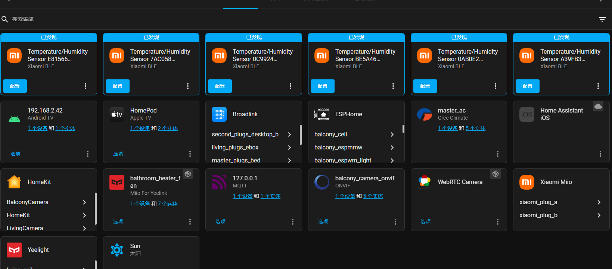
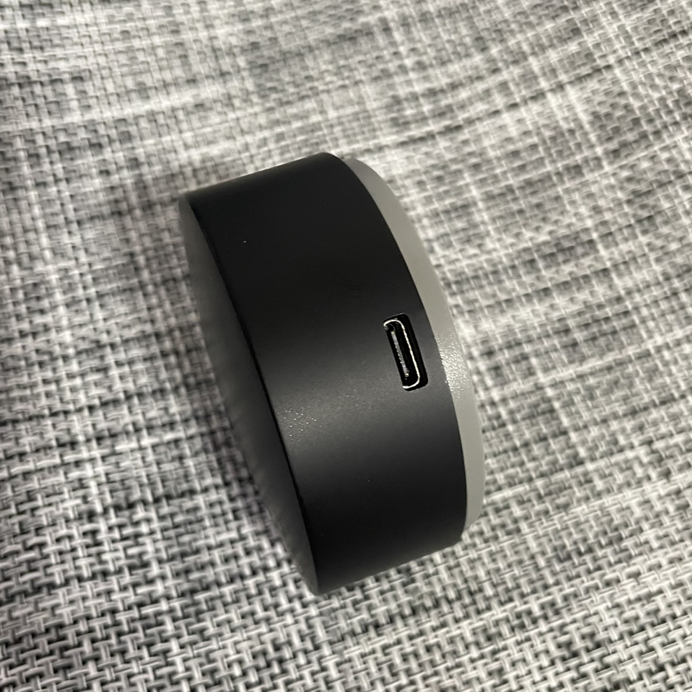
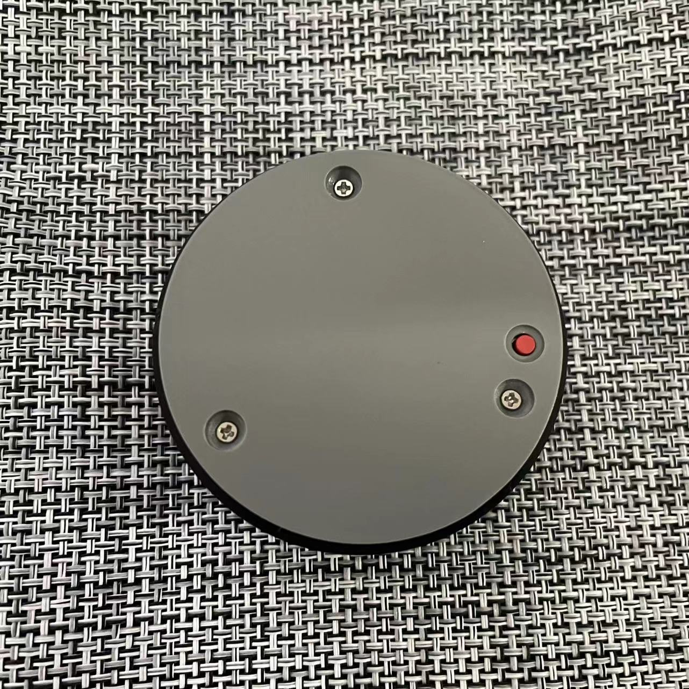
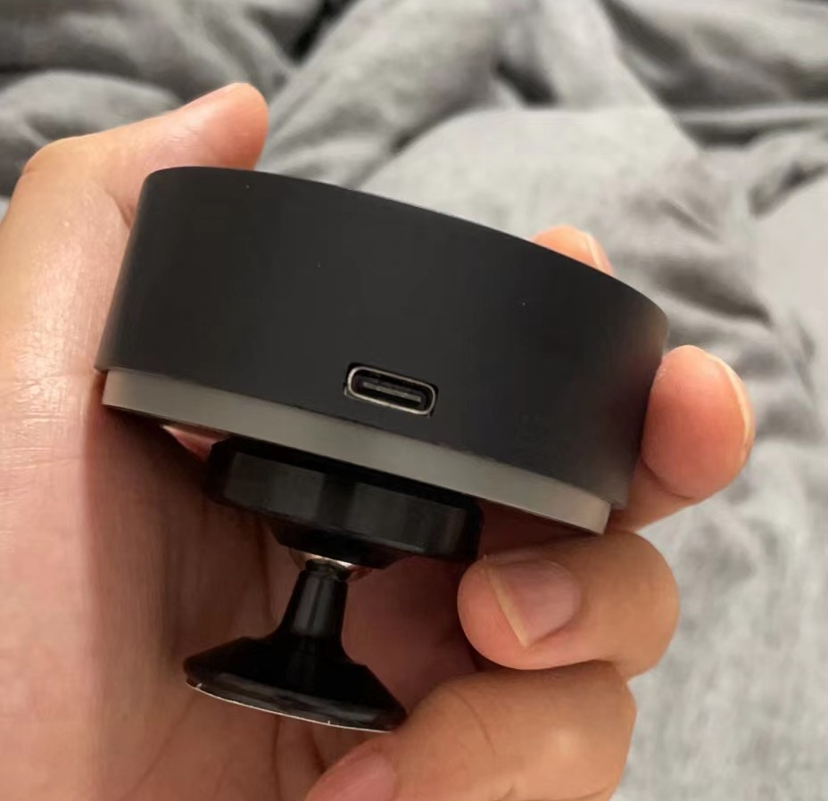

# ESPMMW

## `简介`


# `禁止商用和私自销售，请尊重原创`

### 讨论群： 810581215

最近毫米波很火，正好模块价格也下来了，群友介绍购买了海凌科 `LD2410` 的毫米波模块，参与了早期测试版本。在 `1688` 找到了一个相对完美的[红外遥控外壳](https://detail.1688.com/offer/653134990795.html)，稍加修改之前[S6in1](https://github.com/liwei19920307/S6in1)的项目，画了 `PCB` 测试。为了实现 `LD2410` 串口相关功能，找到了一个外国大佬的[帖子](https://community.home-assistant.io/t/mmwave-presence-detection-esphome-style/382778)，啃了两天 `C++`基础，搞出了相对完美的 `ESPHOME`
固件。因为很忙，都是抽空搞的，整个项目总共花了两个月。`PCB` 测试样品花了一些时间，固件编写也花了几天时间，更多的时间都是用来测试毫米波稳定性，稳定性这里要感谢我的硬件大佬朋友孔老板的指导

### 雷达特点：

- 外观精致
- 支持磁吸底座
- 多功能：人体存在，距离调节，呼吸检测，环境亮度，红外遥控（支持收发，但暂时不能同时使用，`ESPHOME` 的 `BUG`），蓝牙网关（测试过[米家低功耗](https://esphome.io/components/sensor/xiaomi_ble.html)）
- 方便二次开发：`TYPE-C` 接口，支持串口调试（[USB Serial/JTAG](https://docs.espressif.com/projects/esp-idf/en/latest/esp32c3/api-guides/usb-serial-jtag-console.html)）
- 成本低廉（总体硬件成本 `50` 左右）
- 稳定性极好
- 主控 `ESP32C3`

### 材料清单

| 名称                                      | 型号             | 数量 |  PCB 标注  |                           链接                            |
| ----------------------------------------- | ---------------- | ---: | :--------: | :-------------------------------------------------------: |
| LD2410 毫米波雷达                         | LD2410 / LD2410B |    1 |   LD2410   | [购买](https://detail.tmall.com/item.htm?id=676636157827) |
| VS/HX1838/PC638 红外接收头                |                  |    1 |   HX1838   | [购买](https://item.taobao.com/item.htm?id=522552967131)  |
| 3MM 940nm 红外发射管                      |                  |    2 |  LA / LB   | [购买](https://item.taobao.com/item.htm?id=522572541770)  |
| 光敏电阻 5516                             |                  |    1 |   GL5516   | [购买](https://item.taobao.com/item.htm?id=522556415238)  |
| ME1117A33B3G 线性稳压器                   |                  |    1 |   1117-3   | [购买](https://item.taobao.com/item.htm?id=668286085588)  |
| ESP-C3-13U 模块                           |                  |    1 | ESP-C3-13U | [购买](https://item.taobao.com/item.htm?id=652413887471)  |
| 贴片 S8050 J3Y 贴片三极管 500MA SOT-23    |                  |    1 |    J3Y     | [购买](https://item.taobao.com/item.htm?id=522577964105)  |
| 0603 贴片电阻 1MΩ 1 兆欧 1/10W 精度 ±1%   |                  |    1 |     R1     | [购买](https://item.taobao.com/item.htm?id=525898476191)  |
| 0603 贴片电阻 10KΩ 10 千欧 1/10W 精度 ±1% |                  |    1 |     R2     | [购买](https://item.taobao.com/item.htm?id=525777943950)  |
| 直插固态电解电容 1000uF 6.3V 6.3\*11.5mm  |                  |    1 |     C1     | [购买](https://item.taobao.com/item.htm?id=610051037283)  |
| 1206 贴片电容 4.7UF                       |                  |    1 |     C2     | [购买](https://item.taobao.com/item.htm?id=522554031501)  |
| 1.27mm 间距 单排母                        | 1X5P             |    1 |   LD2410   | [购买](https://item.taobao.com/item.htm?id=570980565161)  |
| 贴片 USB-3.1 插座 Type-C 母座 16P         |                  |    1 |   TYPE-C   | [购买](https://item.taobao.com/item.htm?id=573090887123)  |
| 直插 6\*6 轻触开关                        | 5、0 高          |    1 |   BUTTON   |  [购买](https://item.taobao.com/item.htm?id=36605575136)  |
| 2.4G 内置柔性 FPC 软天线                  | IPEX 接头        |    1 |     -      | [购买](https://item.taobao.com/item.htm?id=574057911861)  |
| 304 不锈钢平头自攻螺丝                    | M1.7\*6          |    3 |     -      | [购买](https://detail.tmall.com/item.htm?id=529579107673) |
| 红外转发器外壳                            |                  |    1 |     -      |  [购买](https://detail.1688.com/offer/653134990795.html)  |
| 车载磁吸出风口手机支架                    |                  |    1 |     -      |  [购买](https://detail.1688.com/offer/632680243184.html)  |

### DIY 步骤

打板(板厚选`1mm`)-->焊接-->组装-->刷机

### 固件特点：

- 支持运动、静止状态显示
- 检测距离显示
- 动静距离显示，能量显示
- 动静灵敏度调节
- 动静距离调节
- `ESP32` 状态显示（`IP，MAC，CPU` 温度，运行时间）

## `GPIO`

| GPIO | 功能           |
| ---- | -------------- |
| 0    | 红外接收       |
| 1    | 红外发射       |
| 2    | 背部自定义按键 |
| 3    | 光敏电阻电压   |
| 5、6 | 毫米波串口     |
| 8    | 毫米波状态     |

## `ESPHOME`


| 组件                       | 含义                                                          |
| -------------------------- | ------------------------------------------------------------- |
| espmmw_brightness          | 环境亮度                                                      |
| espmmw_button              | 毫米波背后按钮                                                |
| espmmw_cpu_temprature      | CPU 温度                                                      |
| espmmw_detection_distance  | 检测距离                                                      |
| espmmw_get_conf            | 获取当前毫米波配置                                            |
| espmmw_ip                  | IP                                                            |
| espmmw_mac                 | MAC                                                           |
| espmmw_max_move_distance   | 最大移动距离调节（最大距离=n\*0.75 米）                       |
| espmmw_max_static_distance | 最大静止距离调节 （最大距离=n\*0.75 米）                      |
| espmmw_mmw                 | 毫米波状态（ON-有人，OFF-无人）态                             |
| espmmw_mmw_status          | 毫米波状态（OFF-关闭，MOVE-运动，STATIC-静止，ON 运动或静止） |
| espmmw_move_distance       | 当前运动距离                                                  |
| espmmw_move_energy         | 当前运动能量值                                                |
| espmmw_move_sensitivity    | 移动灵敏度调节                                                |
| espmmw_reboot              | 重启 esp                                                      |
| espmmw_reboot_mmw          | 重启毫米波                                                    |
| espmmw_reset_mmw           | 重置毫米波                                                    |
| espmmw_signal              | WiFi 信号强度                                                 |
| espmmw_static_distance     | 当前静止距离                                                  |
| espmmw_static_energy       | 当前静止能量值                                                |
| espmmw_static_sensitivity  | 静止灵敏度调节                                                |
| espmmw_unattended_duration | 无人持续时间调节                                              |
| espmmw_uptime              | 运行时间                                                      |

## `教程`

- 编译和刷机

  `Linux` （ 以下是在 `x86` 的 `Ubuntu` 下操作的，其他 `Linux` 类似，不支持 `ARM` ）

  1、[安装 docker 及 docker-compose](https://www.bilibili.com/video/BV1vv4y1c7iQ/)

  2、`docker-compose.yml` 文件增加如下内容

  ```yml
  version: "3"
    services:

      esphome:
        image: esphome/esphome:2022.8.0
        container_name: esphome
        volumes:
          - /etc/localtime:/etc/localtime:ro
          - /opt/esphome/conf:/config
          - /dev:/dev
        environment:
          - TZ=Asia/Shanghai
        network_mode: host
        restart: always
        privileged: true
  ```

  3、安装 `esphome` 的 `docker`

  ```
  docker-compose -f docker-compose.yml up -d
  ```

  4、打开 `esphome` 的页面 `http://IP:6052`，新增 `espmmw` 的配置文件，编辑配置文件删除全部，将文件夹[esphme](https://github.com/liwei19920307/ESPMMW/tree/main/esphome)的配置粘贴上去，按需修改后保存

  5、`docker` 服务器执行如下命令进入 `esphome` 的 `docker` 内部

  ```
  docker exec -it esphome bash
  ```

  6、设置 https 代理（这部比较重要，编译需要从`git`下载依赖）

  ```
  export https_proxy=http://IP:PORT
  ```

  7、将毫米波通过数据线插入服务器

  8、执行编译并刷入

  ```
  esphome run espmmw.yaml
  ```

  `Windows`

  将编译的固件放入[flash_tool](https://github.com/liwei19920307/ESPMMW/tree/main/flash_tool)，按说明操作

- [有人无人触发过程](https://www.bilibili.com/video/BV1uU4y167zn)

  | 组件                       | 含义                            |
  | -------------------------- | ------------------------------- |
  | espmmw_mmw                 | 毫米波状态（ON-有人，OFF-无人） |
  | espmmw_move_energy         | 当前运动能量值                  |
  | espmmw_move_sensitivity    | 移动灵敏度调节                  |
  | espmmw_static_energy       | 当前静止能量值                  |
  | espmmw_static_sensitivity  | 静止灵敏度调节                  |
  | espmmw_unattended_duration | 无人持续时间调节                |

  1、当 `espmmw_move_energy` 超大于设定的 `espmmw_move_sensitivity` 时 `espmmw_mmw` 触发 `ON`

  2、当 `espmmw_static_energy` 小于设定的 `espmmw_static_sensitivity` 时 `espmmw_mmw` 触发 `OFF`

  3、`espmmw_mmw` 触发 `ON` 之前都是通过 `espmmw_move_energy` 的值判断的，一旦触发 `ON` 后，后面的检测都是通过 `espmmw_static_energy` 来判断是否 `OFF` 的

  4、我把 `espmmw_move_sensitivity` 设置成 `99` 是为了防止一些轻微的动作误触有人，比如阳台的衣服或者窗帘微动

  5、我把 `espmmw_static_sensitivity` 设置成 `10` 是为了更好的检测呼吸，防止误触无人

  6、实际使用中大家可以根据环境内的 `espmmw_static_energy` 值来设置，因为有些环境 `espmmw_static_energy` 就是高于 `10` 的，我自己家用 `10` 是没啥问题的，但有些地方调高一点比如阳台，防止衣服微动导致无法触发 `espmmw_mmw` 的 `OFF`

- [参数设置](https://www.bilibili.com/video/BV1TU4y16723)

  由于`ESPHOME`的一些限制，还有雷达模块串口设置容易死机，所以需要重复步骤多次确认

  1、先点击`espmmw_get_conf`获取配置，如果配置获取失败拔电重启再重复操作

  2、设置好后一定要点击`espmmw_get_conf`获取配置确认设置成功

- 红外收发

  红外接收一般用来学习遥控器后模拟，或者接收指定代码后，执行特定操作

  请看[rr](https://github.com/liwei19920307/ESPMMW/tree/main/rr)文件夹内的说明

  [收`RAW`码](https://www.bilibili.com/video/BV1jg411r7mz)

  `C3`的`ESPHOME`有`BUG`，需要定义一个没用的`${device_name}_null`

  ```yml
  remote_receiver:
    - id: ${device_name}_null
      pin:
        number: 10
        inverted: true
      dump: raw
    - id: ${device_name}_rr
      pin:
        number: 0
      dump: raw
  ```

  发 RAW 码

  将学习到的`RAW`码填入

  ```yml
    remote_transmitter:
    pin: 1
    carrier_duty_percent: 50%

    - platform: template
    name: ${device_name}_tv_on_off
    on_press:
      - remote_transmitter.transmit_raw:
          carrier_frequency: 38kHz
          code:
            [#这里放入日志中打印的RAW码]
  ```

- 蓝牙网关

  直接采集

  [米家低功耗](https://esphome.io/components/sensor/xiaomi_ble.html)

  [Bindkey 获取](https://esphome.io/components/sensor/xiaomi_ble.html#obtaining-the-bindkey)

  ```yml
  esp32_ble_tracker:
    - platform: xiaomi_lywsd03mmc
      mac_address: #mac
      bindkey: #bindkey
      temperature:
        name: ${device_name}_mi_temperature
      humidity:
        name: ${device_name}_mi_humidity
      battery_level:
        name: ${device_name}_mi_battery
  ```

  `ESPHOME`代理

  `ESPHOME`和`HA`添加配置后重启，`HA`集成里就会出现支持的设备，配置如下

  `HA`的`configuration.yaml`添加

  ```yml
  # Bluetooth
  bluetooth:
  ```

  `ESPHOME`配置添加

  ```yml
  esp32_ble_tracker:

  bluetooth_proxy:
  ```

  

## `问题`

- `LD2410` 的芯片固件还是有一点问题，发送串口命令容易死机，这个需要官方提供固件优化，但串口接收很稳定不影响实际使用

- `LD2410` 的发热很多人觉得温度很高，温度确实比较高，但实际并不影响使用，我已经用了两个月没发现有什么问题

- 红外无法同时使用，硬件并没有问题，`ESPHOME` 的锅，希望有大佬能看到并解决主要应该是 `ESP32C3 RMT` 兼容的问题

## `关于开源`

- 这次 `DIY` 是目前花的时间和精力最多的一次，禁止商用和私自销售，请尊重原创，大家也可以参考我其他项目[S6in1](https://github.com/liwei19920307/S6in1)，和这个[红外遥控外壳](https://detail.1688.com/offer/653134990795.html)自行 `DIY`，时间精力花了不少希望大家理解

- ！！！转载请注明出处 ！！！

## `购买`

[淘宝](https://item.taobao.com/item.htm?id=677669621322)

默认包含雷达和一根数据线，不含充电器

配件可以根据需求自行购买，强烈推荐磁吸底座，数据线长度随机发

由于还有工作，都是抽空 `DIY`，所以发货时间不能保证，但会尽快，希望理解

## `细节`









## `场景`


